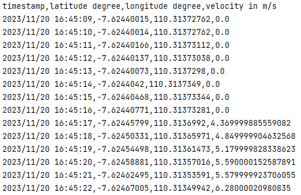

# Velocity Recorder

## Overview

Velocity Recorder is an Android app that uses GPS sensor to measure, record, visualize, and store
velocity or ride
data. The visualization which can happen in real-time consists of chart and other parameters. The
recorded data is stored so that it can be accessed from the History view.

## App Features

- Record and show parameters of a ride:
    - Elapsed time
    - Total distance
    - Average velocity
    - Max velocity
- Record ride velocities over time and visualize the data in an auto-fit line chart
- Record in background so that user can open other app while recording ride data
- Store the ride data so that user can access it from the History view
- Export the ride data as csv file

## Development-related Features

- UI-related
    - Fragments
    - Navigation
    - Recycler View
    - Chart
- Sensor-related
    - Location Listener
    - Permission Request Activity
- Other
    - Room Database
    - Storage Access Framework
    - Foreground Service
    - Notification

## Requirements

- Device: Android 7.0 (Nougat) or later with GPS sensor
- Permission: Location, Foreground Service, Wake Lock

## Usage

- Download APK file from the the [latest release](https://github.com/pandegaabyan/velocity-recorder-app/releases/latest)
- Install and run the app in the Dashboard view
- Click the play button to start recording
- Grant location permission and turn on location as requested
- Some parameters and velocity values will be recorded and displayed
- Feel free to open other app as the recording will still continue in the background
- Click the stop button to stop recording
- Check the recorded data and others in the History view
- Check the detail of a ride by clicking it
- Delete a ride data by clicking the delete icon
- Export a ride data by clicking the export icon

## Views

|                                Dashboard View                                 |                               History View                               |
|:-----------------------------------------------------------------------------:|:------------------------------------------------------------------------:|
|  |  |

| Example CSV File - [check the file here](attachments/ride%20%2314%20-%202023-11-20T16-45-09%20to%202023-11-20T16-51-17.csv) |
|-----------------------------------------------------------------------------------------------------------------------------|
|                                                            |

## Credits

During development, we learn a lot
from [Topsed-Speedometer](https://github.com/praslnx8/Topsed-Speedometer)
and [VelocidadSimple](https://github.com/voidregreso/VelocidadSimple).
Moreover, some of our codes are directly from the former as stated in the [NOTICE file](./NOTICE).
We also use [MPAndroidChart](https://github.com/PhilJay/MPAndroidChart) for plotting the line chart