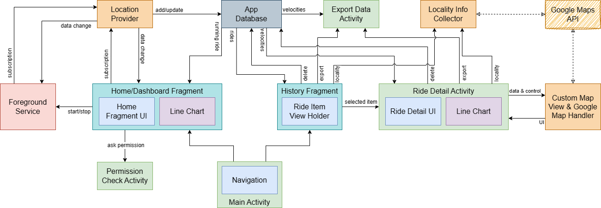

# Velocity Recorder

## Overview

Velocity Recorder is an Android app that uses GPS sensor to measure, record, and visualize
velocity or ride data. The visualization consists of chart, map, and other parameters.
The recorded data is stored so that it can be accessed from the History view.

## App Features

- Record and show parameters of a ride:
    - Elapsed time
    - Total distance
    - Average velocity
    - Max velocity
- Record ride velocities over time and visualize the data in auto-fit line chart
  and dynamic interactive map
- Record in background so that user can open other app while recording ride data
- Store the ride data so that user can access it from the History view
- Export the ride data as csv file
- Note that the app don't collect any data, all processes are running locally, except when using
  Google Maps API

## Development-related Features

- UI-related
    - Fragments
    - Navigation
    - Chart
    - Recycler View
    - Scroll View
    - Map View
- Sensor-related
    - Location Listener
    - Permission Request Activity
- Other
    - Room Database
    - Storage Access Framework
    - Foreground Service
    - Notification
    - Geocoding
    - Map Customization

For map handling and geocoding, developer need to put their own Google Maps API Key in
[app.properties](app.properties)

## Requirements

- Device: Android 7.0 (Nougat) or later with GPS sensor
- Permission: Location, Foreground Service, Wake Lock, Internet
- Note that internet access is only for calling Google Maps API
- For working properly in the background, user may need to disable restriction related to
  battery saving or something like that

## Usage

- Download APK file from the
  the [latest release](https://github.com/pandegaabyan/velocity-recorder-app/releases/latest)
- Install and run the app in the Dashboard view
- Click the play button to start recording
- Grant location permission and turn on location as requested
- Some parameters and velocity values will be recorded and displayed
- Feel free to open other app as the recording will still continue in the background
- Click the stop button to stop recording
- Check the recorded data and others in the History view
- Check the detail of a ride by clicking it
- Detail of the ride includes ride parameters, line chart, and interactive map
- Update locality of start/end location by clicking the marker icon
- Delete a ride data by clicking the delete icon
- Export a ride data by clicking the export icon

## Attachments

| Connections between Components                                                           |
|------------------------------------------------------------------------------------------|
|  |

|                                Dashboard View                                 |                               History View                               |                    Ride Detail                     |
|:-----------------------------------------------------------------------------:|:------------------------------------------------------------------------:|:--------------------------------------------------:|
|  |  |  |

| Example CSV File - [check the file here](attachments/ride%20%2314%20-%202023-11-20T16-45-09%20to%202023-11-20T16-51-17.csv) |
|-----------------------------------------------------------------------------------------------------------------------------|
|                                                            |

## Credits

During development, we learn a lot
from [Topsed-Speedometer](https://github.com/praslnx8/Topsed-Speedometer)
and [VelocidadSimple](https://github.com/voidregreso/VelocidadSimple).
Moreover, some of our codes are directly from the former as stated in the [NOTICE file](./NOTICE).
We also use [MPAndroidChart](https://github.com/PhilJay/MPAndroidChart) for plotting the line chart